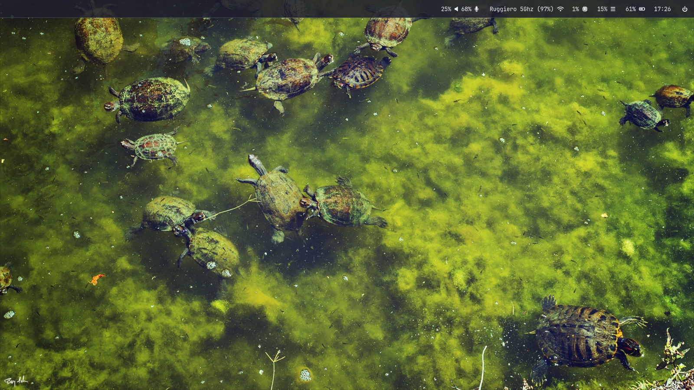

# DwlSetup

## Descrizione
DwlSetup è una configurazione minimale e personalizzata di dwl basata su wlroots 0.19,
pensata per essere semplice da compilare e usare su sistemi Wayland leggeri.


## Preview



### Dipendenze
- wlroots 0.19
- pavucontrol
- wlsunset
- wofi
- firefox
- waybar
- xdg-desktop-portal-wlr
- grim
- slurp
- foot
- brightnessctl
- (Dipendenze interne di dwl – da aggiornare)

## Installazione
```bash
sudo make clean install
```

## Avvio (Da tty)
copia o crea un link simbolico lo script dwl.sh nella cartella scripts per eseguire dwl nella cartella home.

## Licenza
Il codice di questo repository è rilasciato sotto licenza MIT.  
© Autori originali di dwl. Vedi il file LICENSE per il testo completo.

